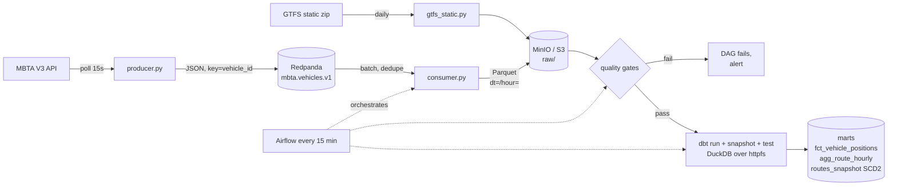

```mermaid
flowchart LR
    API[MBTA V3 API] -->|poll 15s| P[producer.py]
    GTFS[GTFS static zip] -->|daily| G[gtfs_static.py]
    P -->|JSON, key=vehicle_id| K[(Redpanda<br/>mbta.vehicles.v1)]
    K -->|batch, dedupe| C[consumer.py]
    C -->|Parquet<br/>dt=/hour=| S3[(MinIO / S3<br/>raw/)]
    G --> S3
    S3 --> Q{quality gates}
    Q -->|fail| X[DAG fails,<br/>alert]
    Q -->|pass| D[dbt run + snapshot + test<br/>DuckDB over httpfs]
    D --> M[(marts<br/>fct_vehicle_positions<br/>agg_route_hourly<br/>routes_snapshot SCD2)]
    AF[Airflow every 15 min] -.orchestrates.-> C
    AF -.-> Q
    AF -.-> D
```
